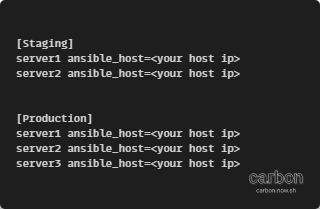
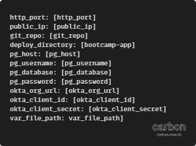

Even the great ansible 

Needed ender

---

# Description

In this repository there is an ansible code for configurating a nodejs app on server deployed on two enviroments Stging & Production

---

## Notes

Ansible

As part of a DevOps bootcamp is sela accademy [Sela DevOps Bootcamp Page](https://rhinops.io/bootcamp).

## Deployment

Connect to your Controller machine and install ansible.
Follow instraction presented beutifully [Labs for ansible](https://gitlab.com/ansible-workshop/labs).

after installation will need to edit our ansible files:

- An Inventory file that holds our hosts that will containe the app

- A vars.yml for our enviroment Secrats

### now run the command

> ansible-playbook -i "Inventory file path" "Playbook file path" --extra-vars "group=<sTaging/Production>"

in order to play the playbook with your configuration insted of the defulte ones

--extra-vars is requirde to tell ansible which enviroment to play on

enoy !
